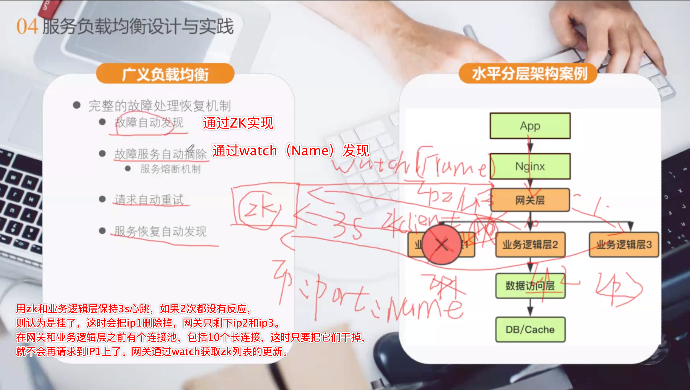
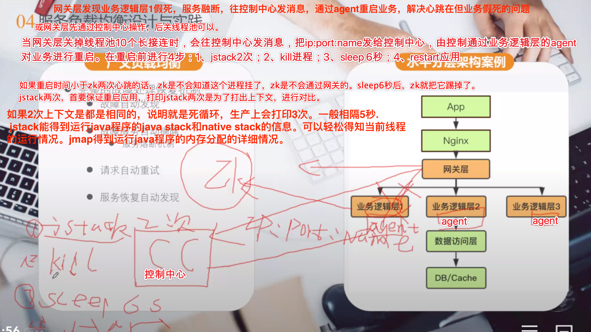
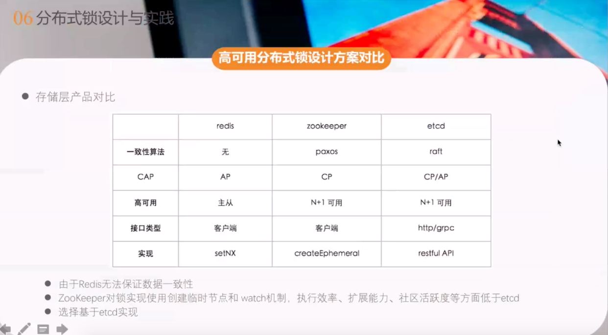
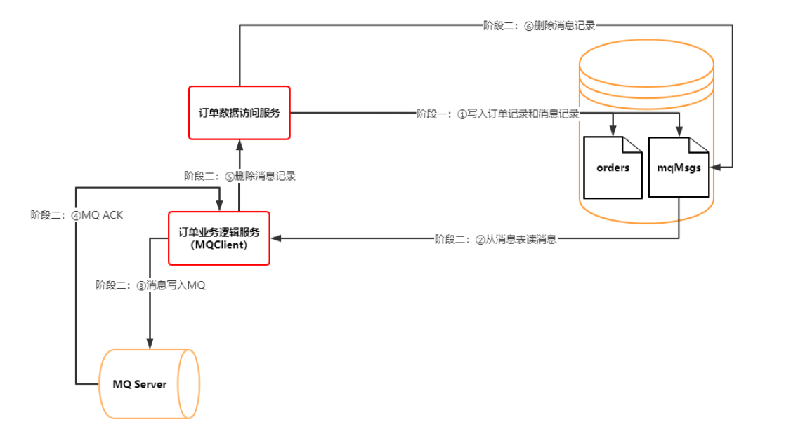
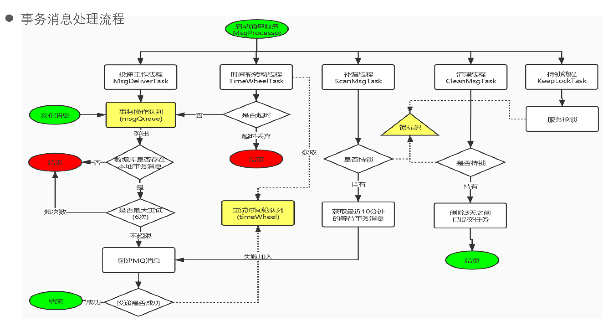
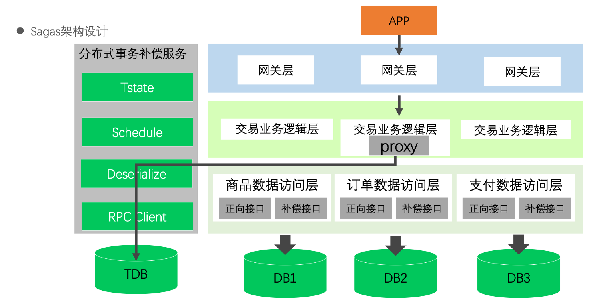
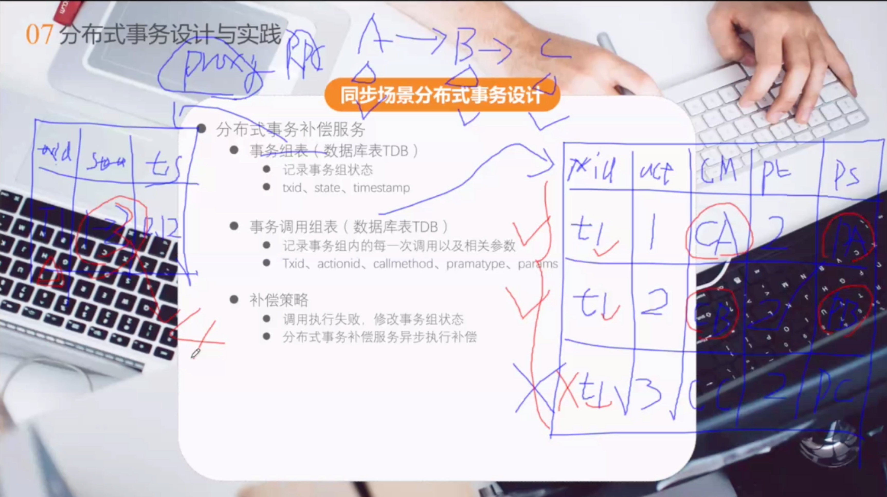
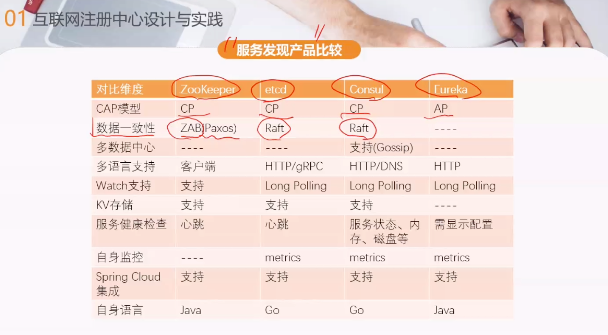
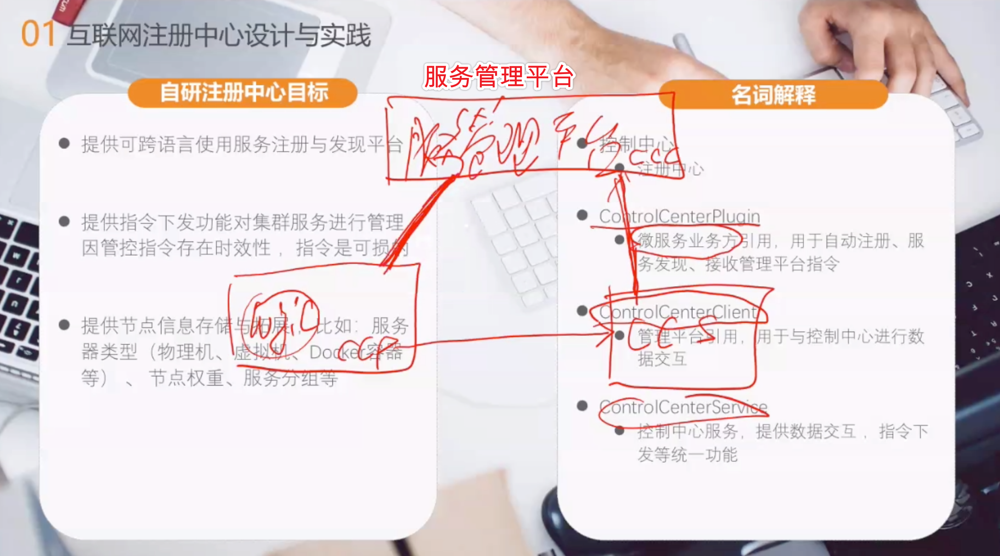
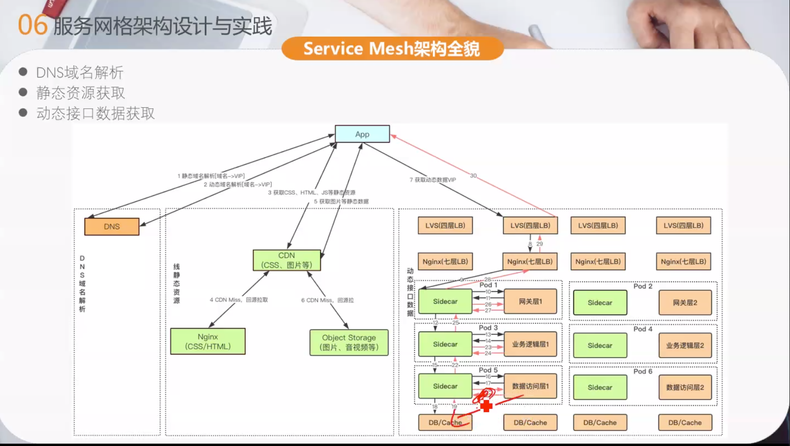

Redis cluster有局限，查询是在客户端，如果一次查询10个Key，mget需要落在一个主从上才可以做到。

为什么不用一致性哈希算法？

TiDB的协调器也是基于Raft协议

业务线程假死，Etcd client ttl线程还在跑，怎么办？

线上分布式锁最长10s。

补偿方法是有要重试的。

线程共享通过threadLocal，进程共享rpc字段

给一个字符串，转成12345。 valueOf, parseInt

熔断之后，会先返回给用户信息，然后悄悄的去尝试是否恢复了。如果尝试成功，也只是为了探测用，不会返回用户。如果熔断的是写请求，那业务可能会出问题，如果是读请求而没有问题。如果是支付接口，则不能熔断。如果允许脏数据，则也OK。

如果实现平台化的熔断，像转转，那么只需要在方法上加注解就可以了。

熔断dao层，控制中心（注册中心）会往所有的service层发送指令。

MQ如果堆积了大量消息怎么办？

1、增加下游消费节点快。2、如果允许消息丢失，消费到100的时候挂了，但写到10000了，则直接把断点改成10000，以后消息直接从10000开始消费。

Linux下监控

df -h

free -g

vmstat

ifstat

-------

#### 服务分级

一级服务：收入达到公司在线收入的1/10；服务每天PV（page view）达到5kw以上；核心系统。如列表系统、详情系统、发布系统、计费系统、支付系统，订单系统、DNS等

二级服务：服务每天达到1kw以上；收入达到公司在线收入的1/20；重要商务系统；核心系统。如消息系统、个人中心、CRM、权限系统，办公网络等

三级服务：其它

#### 高可用

如何无缝停止线上服务

网关开关拒绝请求。判断请求完成：1、看日志。2、根据超时时间。实现方式：请求在放入队列中，work线程从中取。开关为0不处理，为1则继续处理。

如网关不具备热切换能力，使用使用防火墙限制只出不进。

#### 架构设计优化层次

提前拒绝，减少无效请求

分布式系统微服务化

无状态化设计，动态水平弹性扩展

分布式cache，多级多类型缓存

调用链路梳理，热点数据尽量靠近用户

分库分表，读写分离，数据分片

#### 服务无状态化案例

如果让网关无状态化，在网关中对用户不做hash，可以在网关下面做一层proxy来完成此功能。proxy+redis主从其实就是用codis，Session存到redis中，如果1亿用户，可对其分128片。

如果对其扩容，可以低峰时段，比如晚上1点钟，重启网关后，新的session就会打到新的分片上。

为什么不用一致性hash?

一致性hash是一个互不干涉，当app进来的时候，会通过hash落在环上的某一个点上。但当网络越时，会顺时针下到下一个点上，发现没有，则会重新创建一个放到B上。下次网络正常了，再访问A，则A的session数据就是旧数据了，会有数据不一致问题。

解决：如果验收A过期了，则重新生成。如果对数据一致性要求比较高，则适用。

#### 负载均衡

zk和业务逻辑层保持3s心跳，网关通过watch获取zk列表的更新。如果2次心跳都没有反应，则认为是挂了，这时会把故障ip1删除掉，网关就只剩下ip2和ip3。

在网关和业务逻辑层之前有个连接池，包括10个长链接，这时只要把它们干掉，就不会再请求到IP1上了。

但是通过zk不能发现业务逻辑层1，即IP1所有的问题。当业务逻辑层机器1本身挂了，但工作线程处于假死或由于BUG不能继续进行了，但zk心跳仍旧在，这时应该怎么办呢？

在网关层记录所有的response，把它们放到队列中，然后计算失败返回数，比如失败-1，超时-2，（失败+超时）/总response数 >30%，则认为业务逻辑层1出了问题，但这时zk和业务逻辑层心跳还在，如何优雅停机呢？

网关发现业务逻辑层1假死，服务融断，往控制中心发消息，通过agent重启业务，解决心跳在但业务假死的问题。

重启前进行4步

1. Stack 3次，一般相隔5秒。打印多次是为了打印上下文，进行对比，如果上下文相同，则说明就是死循环。
2. kill进程
3. Sleep 6秒。为什么是6秒呢？因为如果应用重启时间小于zk两次心跳的话，zk是不会知道这个进程挂了的，sleep6秒后，zk就会把它踢掉。
4. restart应用

#### 幂等

##### 数据库

插入：可以根据业务主键幂等，下次插入业务主键即可，但自增主键无法幂等。可以考虑使用分布式id替代，有序id在数据库中插入可以利用索引，效率会高。

更新：对于更新，相对值不是幂等。做法1：先查出来，然后根据id去做绝对值更新。做法2：加条件：update user set age++ where uid=58 and age=18。但方法2在大并发情况下，性能并不好，如果uid是主键可能还会好一点。

##### 业务层面幂等

在MQ中，有2个相同的msg，可以根据orderId去幂等，用分布式锁将并行的改为串行，业务层面的幂等本质就是分布式锁的问题。

MQ消息端去重

#### 分布式锁

##### redis

是否应用redis锁，得看业务场景。如果是发消息或社交场景，用redis没有问题。如果是交易场景就不行了。

redis存在问题：

redis分布式锁是AP模型。

redis锁无法续租期。

redis存在单点问题：单实例存在进程一旦死掉，会彻底阻塞业务流程；主从方式，主从数据异步，会存在锁失效问题。

官方建议redis使用redlock算法保证，但至少要三个redis主从实例来完成，redlock等同于自己实现简单一致性协议，细节繁琐，易出错。（等考证）。redlock也是一个CP模型。

分布式锁对比如下，同是CP模型，Etcd优于zk

##### ETCD

Etcd client TTL模式，Etcd支持续租，一般后台心跳是租期1/3。

转转公司锁平均耗时约为2.1ms左右

分布式锁在同一自然时间的互斥锁，本身不解决幂等性问题。比如如果T1锁执行太快，T2后拿到分布式锁，又会执行。这时需要业务本身去保证。比如order订单，T2执行的时候，去判断一下order的状态。

特殊场景：etcd内部协调发生问题：Leader节点挂了，选主中；Raft日志数据同步发生错误或者不一致问题。在要求极高的情况下，需要准备2套Etcd分布式锁，第1套不行了，切换成第2套。

### 分布式事务

#### TCC模型

TCC模型完全由业务实现，每个子业务都需要实现 try-confirm-cancel接口，对业务侵入大，对资源锁定交由业务方。

#### Saga模型

把一下分布式事务拆分成多个本地事务，每个本地事务都有相应的执行模块和补偿模块（对应TCC的Confirm和Cancel）

可以看到，和TCC相比，Saga没有“预留”动作，它的Ti就是直接提交到库。

**Saga的执行顺序有两种：**

- T1, T2, T3, ..., Tn
- T1, T2, ..., Tj, Cj,..., C2, C1，其中0 < j < n

**Saga定义了两种恢复策略：**

- backward recovery，向后恢复，补偿所有已完成的事务，如果任一子事务失败。即上面提到的第二种执行顺序，其中j是发生错误的sub-transaction，这种做法的效果是撤销掉之前所有成功的sub-transation，使得整个Saga的执行结果撤销。
- forward recovery，向前恢复，重试失败的事务，不断retry。

**Saga一些限制：**

1. Saga只允许**两个层次的嵌套**，顶级的Saga和简单子事务
2. 在外层，全原子性不能得到满足。也就是说，sagas可能会看到其他sagas的部分结果
3. 每个子事务应该是独立的原子行为

Saga不提供ACID保证，因为原子性和隔离性不能得到满足。

**Saga协调**

协调saga：saga的实现包含协调saga步骤的逻辑。当系统命令启动saga时，协调逻辑必须选择并告知第一个saga参与者执行本地事务。一旦该事务完成，saga的排序协调选择并调用下一个saga参与者。这个过程一直持续到saga执行了所有步骤。如果任何本地事务失败，则saga必须以相反的顺序执行补偿事务。构建一个saga的协调逻辑有几种不同的方法：

- 编排（Choreography）：在saga参与者中分配决策和排序。他们主要通过交换事件进行沟通。
- 控制（Orchestration）：在saga控制类中集中saga的协调逻辑。一个saga控制者向saga参与者发送命令消息，告诉他们要执行哪些操作。

参考：[分布式事务：Saga模式](https://www.jianshu.com/p/e4b662407c66)

#### 和TCC对比

Saga相比TCC的缺点是缺少预留动作，导致补偿动作的实现比较麻烦：Ti就是commit，比如一个业务是发送邮件，在TCC模式下，先保存草稿（Try）再发送（Confirm），撤销的话直接删除草稿（Cancel）就行了。而Saga则就直接发送邮件了（Ti），如果要撤销则得再发送一份邮件说明撤销（Ci），实现起来有一些麻烦。

如果把上面的发邮件的例子换成：A服务在完成Ti后立即发送Event到ESB（企业服务总线，可以认为是一个消息中间件），下游服务监听到这个Event做自己的一些工作然后再发送Event到ESB，如果A服务执行补偿动作Ci，那么整个补偿动作的层级就很深。

不过没有预留动作也可以认为是优点：

- 有些业务很简单，套用TCC需要修改原来的业务逻辑，而Saga只需要添加一个补偿动作就行了。
- TCC最少通信次数为2n，而Saga为n（n=sub-transaction的数量）。
- 有些第三方服务没有Try接口，TCC模式实现起来就比较tricky了，而Saga则很简单。
- 没有预留动作就意味着不必担心资源释放的问题，异常处理起来也更简单（请对比Saga的恢复策略和TCC的异常处理）。

上面都是同步场景，下面看一下异步场景

#### RocketMQ本身的分布式事务

1. 发送prepare消息，该消息对Consumer不可见

2. 执行本地事务

3. 若本地事务执行成功，则向MQ提交消息确认发送指令；若本地事务执行失败，则向MQ发送取消指令

4. 若MQ长时间未收到确认发送或取消发送的指令，则向业务系统询问本地事务状态，并做补偿处理

业务方提供本地操作成功回查功能。半消息：暂时不能投递，发送方已经将消息成功发送到了MQ服务端，但是服务端未收到生产者对消息的二次确认，此进消息被标记成“暂不能投递”状态，处于该状态下的消息即关消息。如果MQ服务端通过扫描发现某条消息长期处于“半消息”时，需要主动向消息生产者询问该消息的最终状态（commit或Rollback），即消息回查。

#### 本地事务消息表

事务消息处理流程，如下图所示

服务端会有重复消息，应该在消费端使用分布式锁和业务状态处理幂等

如果saga回滚失败，则1、记录错误日志；2、报警；3、人工介入

sagas架构设计

Sagas同步补偿，通过RPCProxy代理记录当前调用请求参数，如果业务异步，如何反向补偿? 补偿方法由业务方提供，在方法上加注解标识。在配置中心做调用方法（正向接口）和补偿方法的一对一映射。

#### 服务降级

1、拒绝部分老请求

减轻微服务请求处理数据；确保“新”请求正常响应；RPC队列方式。

请求入队列，入队列前记录入队时间。工作线程从队列中取请求，即出队列时间。如果endTime-startTime<1s则执行。如果大于1s，再加上业务执行时间 ，请求也很可能会超时，所以拒绝部分老请求。但仅拒绝老请求，还是不够的，还要保证丢的是非核心请求，留下来的是核心请求。

2、优先级请求方式

非核心请求直接丢弃；

在请求header中加入优先级字段cmd，在配置中心开启优先级请求策略，开启后，进行拒绝部分请求，然后按优先级进行拒绝。策略存在配置中心，开关后，策略开始拒绝优先级低的老请求。

服务层降级后，请求数量应该是一个漏斗形状，应该做每一层都做降级：网关层、业务逻辑层、数据访问层。

#### 灰度发布

如果业务逻辑层和数据访问层都需要灰度，则需要通过在网关打tag，只通过uid等是无法做到对流程打tag的，需要在请求header中加tag字段。全链路压测，还需要在请求header中加字段mtest，以做标识。

数据的灰度，只有双写。如果是部分灰度的话，一旦灰度失败，则会数据丢失。

#### 压测

##### 压测工具

JMeter，TCPCopy，Apache ab

#####极限标准

机器load average 不超过CPU核数*0.6

服务进程CPU占用率不超过(CPU核数*0.6)*100/机器部署的服务进程数

网卡流程不超过网卡容量的60%（超过可能延时较大）

请求超时不超过十万分之一

QPS不低于预估的85%，否则需要优化，或者给出合理解释。

##### 压测透传

跨线程间的透传

ThreadLocal，利用InheritableThreadLocal的特性，对于父线程ThreadLocal中的变量会传递给子线程，保证了压测标识的传递。

跨进程（服务）间的透传

存储在定长Header中，添加压测标识属性mtest，以保证传输过程中始终带着测试标识。

#### 服务发布产品比较

zk不适合做服务注册和发现，服务的注册和发现应该使用AP模型。zk几百台机器没有问题，上千台就会被打爆。几百台是可以用zk的。

zk适用场景：大数据、离线任务；分布式协调。Hadoop/Storm/HBase/Solr/Spark/Flink/Kafka/Mesos/Neo4J以上分布式协调器都是用的zk。

zk不适用场景：大规模交易；大规模服务发现。

就注册中心而言，转转使用自研注册中心。

#### 分布式请求跟踪系统

推荐三种：Twitter Zipkin, Apache skyWalking(APM), Pinpoint(APM)

#### 容器日志收集方案

Log-pilot，是阿里云开源的一款实时采集容器日志的工具。

#### Service Mesh架构全貌

#### sharding

如果1行大于100字节，那么就是1kw一张表。

如果1行小于100字字，那么就5kw一张表。

片键越随机越好

如果是按时间查询，2种场景：1、统计数据，这时候遍历所有表即可。因为统计数据对时效性不高。2、查询最新的iphoneXs，这时就是一个搜索引擎场景，这时候用ES就行。

sharding推荐sharing-JDBC/Sphere

#### sharding基因法

普通水平切分：
　　根据帖子ID切分则无法一次查询用户的所有帖子；
　　根据用户ID切分则需要先查帖子所属用户；

什么是分库基因？
　　通过uid分库，假设分为16个库，采用uid%16的方式来进行数据库路由，这里的uid%16，其本质是uid的最后4个bit决定这行数据落在哪个库上，这4个bit，就是分库基因。

在生成tid时，先使用一种分布式ID生成算法生成前60bit
　　将分库基因加入到tid的最后4个bit
　　拼装成最终的64bit帖子tid

这般，保证了同一个用户发布的所有帖子的tid，都落在同一个库上，tid的最后4个bit都相同，于是：
　　通过uid%16能够定位到库
　　通过tid%16也能定位到库

**实际使用中，可以使用后8位一致**

#### 数据库优化

永远用小结果集驱动大结果集，而非小表驱动大表。

子查询比较差，绝大部分子查询可以用join替代。

对于经常更新的字符串使用char，而不要使用varchar。处理text/blob比处理varchar复杂的多。因此能使用char时不要使用archer，能使用varchar时不要使用text表。

对容易产生碎片的表使用optimize table。【当你删除数据时，mysql并不会回收，被已删除数据的占据的存储空间，以及索引位。而是空在那里，而是等待新的数据来弥补这个空缺，这样就有一个缺少，如果一时半会，没有数据来填补这个空缺，那这样就太浪费资源了。所以对于写比较频烦的表，要定期进行optimize，一个月一次，看实际情况而定了。】

SQL尽量在索引中完成排序

#### 开源监控框架

Zabbiz, Open-Falcon, Prometheus+Grafana

--- 问题 -----

如何提高缓存命中率

netty的长链接是怎么做？

